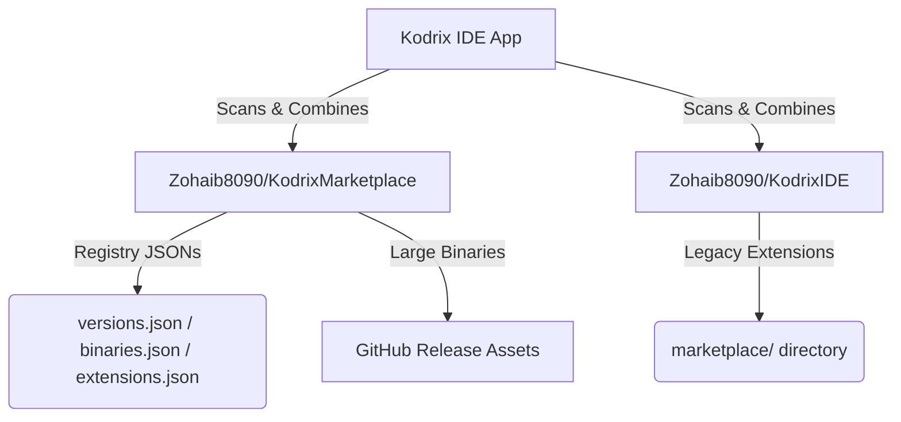

# Kodrix IDE — Marketplace & Runtime Architecture

This document provides a complete guide to the architecture of the **Kodrix IDE Marketplace** and **Runtime Registry system**. It is designed to help developer agents and AI assistants understand the design, files, endpoints, and codebase logic without any prior context.

---

## 1. Core Architecture Overview

To keep the primary application codebase clean, lightweight, and to bypass GitHub's 100MB file size limit for large binary files, Kodrix IDE uses a **decoupled, multi-repository system** for serving extensions and compiler toolchains.



---

## 2. The Repositories

### A. The Core App Repository: `Zohaib8090/KodrixIDE`
* **Purpose**: Holds the source code for the Android application (Kotlin, Jetpack Compose, Native binaries, and Gradle build configuration).
* **Branches**:
  * `main`: Active branch containing all source code.
  * `libs`: **Deprecated/Migrated**. Previously hosted registry data. It now contains only a `README.md` pointing to `Zohaib8090/KodrixMarketplace`. All JSON registry files have been cleaned up on this branch to avoid stale records.

### B. The Marketplace Repository: `Zohaib8090/KodrixMarketplace`
* **Purpose**: A standalone repository dedicated purely to hosting marketplace metadata, version registries, and release assets.
* **Default Branch**: `main`
* **GitHub URL**: `https://github.com/Zohaib8090/KodrixMarketplace`

---

## 3. Registries & JSON Schemas

All registry files are fetched dynamically by the app via `raw.githubusercontent.com`.

### 1. `versions.json`
* **Path**: `Zohaib8090/KodrixMarketplace/main/versions.json`
* **Purpose**: Maps available Node.js runtime versions to their target ABI zip file URLs.
* **Schema**:
```json
{
  "versions": [
    {
      "version": "18.16.0",
      "abis": {
        "arm64-v8a": "https://github.com/Zohaib8090/KodrixMarketplace/releases/download/node-v18.16.0/node-v18.16.0-android-arm64.zip",
        "armeabi-v7a": "https://github.com/Zohaib8090/KodrixMarketplace/releases/download/node-v18.16.0/node-v18.16.0-android-arm.zip"
      }
    }
  ]
}
```

### 2. `binaries.json`
* **Path**: `Zohaib8090/KodrixMarketplace/main/binaries.json`
* **Purpose**: Used by the app to check for compiler/runtime updates via `BinaryUpdater.kt`.
* **Key format**: `snake_case` (matches what `BinaryUpdater.kt` parses via `json.getString("node_version")` etc.)
* **Schema**:
```json
{
  "node_version": "v22.0.0",
  "node_url": "https://raw.githubusercontent.com/Zohaib8090/KodrixMarketplace/main/binaries/node-arm64.zip",
  "git_version": "v2.41.0",
  "git_url": "https://raw.githubusercontent.com/Zohaib8090/KodrixMarketplace/main/binaries/git-arm64.zip",
  "notes": "Optional release notes shown to the user."
}
```

> ⚠️ **Do NOT use camelCase keys** (`nodeVersion`, `gitVersion`). The JSON parser in `BinaryUpdater.kt` uses `node_version` / `git_version` / `node_url` / `git_url`.

### 3. `marketplace/` Folder
* **Path**: `Zohaib8090/KodrixMarketplace/main/marketplace/`
* **Structure**: Each extension is stored in its own sub-folder:
  * `marketplace/python-support/manifest.json`
  * `marketplace/web-lsp/manifest.json`
* **manifest.json Schema**:
```json
{
  "id": "python-support",
  "name": "Python Language Support",
  "description": "Python code auto-completion and analysis extension",
  "version": "1.0.2",
  "author": "Kodrix",
  "icon": "https://raw.githubusercontent.com/Zohaib8090/KodrixMarketplace/main/marketplace/python-support/icon.png",
  "type": "extension"
}
```

---

## 4. App Code Integration (Kotlin)

### A. Multi-Repository Scan (`ExtensionManager.kt`)
To guarantee backward compatibility and ensure no existing running extensions are broken, the app queries **both** repositories and combines the list of extensions. It filters out duplicates, prioritizing `KodrixMarketplace`.

```kotlin
// ExtensionManager.kt
private val REPOSITORIES = listOf(
    "Zohaib8090/KodrixMarketplace",
    "Zohaib8090/KodrixIDE"
)

suspend fun scanMarketplace(context: Context, token: String? = null, ...): List<Extension> {
    val allExtensions = mutableListOf<Extension>()
    for (repo in REPOSITORIES) {
        val repoExtensions = scanSingleRepository(context, repo, token, ...)
        allExtensions.addAll(repoExtensions)
    }
    // De-duplicate by extension ID, keeping the one from the new repo first
    return allExtensions.distinctBy { it.id }
}
```

* **Dynamic Origin Tracking**: The `Extension` data class includes a `repo` field. During compilation or installation, the download ZIP path is dynamically constructed using that specific extension's origin repository:
  ```kotlin
  val downloadUrl = if (version != null && version != "Latest") {
      "https://github.com/${extension.repo}/archive/refs/tags/$version.zip"
  } else {
      extension.downloadUrl
  }
  ```

### B. Dynamic Runtime Check (`BinaryManager.kt`)
Queries `versions.json` directly from the `KodrixMarketplace` main branch:
```kotlin
val registryUrl = "https://raw.githubusercontent.com/Zohaib8090/KodrixMarketplace/main/versions.json"
```

### C. Updates Checker (`TerminalViewModel.kt`)
Fetches the `binaries.json` file to check for newer releases of Node.js and Git:
```kotlin
val registryUrl = "https://raw.githubusercontent.com/Zohaib8090/KodrixMarketplace/main/binaries.json"
```

### D. VersionChecker (`VersionChecker.kt`)

A singleton that verifies which binary is **actually running on disk** by executing `binary --version`. It is never polled — it only runs on two triggers:

1. **After a download completes** — to confirm the extracted binary works
2. **When the user activates a version** (taps "Use") — to confirm the switch

Results are emitted to a `StateFlow<Map<String, VerifiedVersion>>` and shown in the Marketplace UI as chips:
- `✓ v22.0.0` (green) — binary ran successfully
- `⚠ Verification failed` (amber) — binary missing, not executable, or crashed

**Crash-recovery flow:**
```
downloadVersion()
  ├─ writes download.tmp marker to the version folder
  ├─ downloads + extracts the zip
  └─ on success: deletes download.tmp, calls VersionChecker.check()
       on crash:  marker stays, cleaned up by BinaryManager.cleanUpStaleDownloads() on next launch
```

**Backup system:**
Old versions are **never deleted**. Switching to a new version leaves the old one on disk in `versions/<tool>/<ver>/`. The user can revert instantly by tapping "Use" on the old version card in the Marketplace → Node.js tab.

---

## 5. Maintenance Guide for Developers

When releasing a new tool runtime or a marketplace extension:

1. **Host Large Binaries**:
   * Never commit `.zip` packages directly to git.
   * Go to [Zohaib8090/KodrixMarketplace Releases](https://github.com/Zohaib8090/KodrixMarketplace/releases).
   * Create a new Release/Tag (e.g., `node-v18.16.0`).
   * Upload the ABI-specific ZIP binaries as release assets.

2. **Update Registry Files**:
   * Modify `versions.json`, `binaries.json`, or the folders under `marketplace/` in the `KodrixMarketplace` repository.
   * Push changes to the `main` branch.
   * The app fetches these changes instantly over the network.
